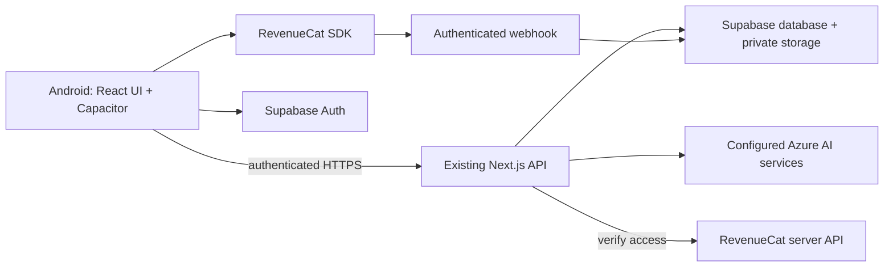

# StudyMate mobile — Next Gen implementation plan

Prepared September 21, 2026. Status: proposed implementation, not built or runtime-verified.

## 1. Outcome and constraints

Deliver an installable Android app that helps a university student understand uploaded course material, practise applying it, identify mistakes, and leave with a useful revision document. Demonstrate a real RevenueCat-controlled premium feature. Submit to Shipaton Next Gen with reproducible public source and a short device demo.

User confirmed student/academic-email availability and no previous app-store publication. Verify the email domain and remaining eligibility details during setup. Official deadline: September 30, 23:45 PDT / October 1, 07:45 WAT. Internal submission target: September 29, 18:00 WAT. September 30 is a repair buffer.

Planning assumptions: one developer, approximately 45–60 focused hours, an Android phone or emulator, access to the existing backend services, and permission to use the test course material. These are estimates and assumptions, not confirmed resources. If substantially fewer hours are available, use the scope cuts in section 12.

The first course used for validation will be Law of Torts, aligned with the existing example content. This limits the demonstration and QA surface; it does not permanently turn StudyMate into a law-only product. Use academic practice material, not advice about a user's real legal situation.

## 2. Product boundaries

Retain the repository's central progression: upload, learn, practise, and produce a revision PDF. Plain and Story modes remain available within learning; Matey provides brief guidance. Existing modules should sit behind this journey, rather than becoming a menu of separate tools. The repository's AGENTS.md identifies CONTEXT.md as the current product reference and calls for local Next.js 16 documentation before framework-sensitive changes. [Repository instructions and context](https://github.com/adetorojeremiahfadesayo/StudyMate/blob/main/studymate/CONTEXT.md).

### Required for the hackathon

| Area | Deliverable | Observable acceptance condition |
|---|---|---|
| Mobile | Android package with bundled UI | Installs, launches, handles Back and keyboard without breaking navigation |
| Identity | Sign in, persistent session, sign out | Relaunch restores the correct account; a second account cannot see its data |
| Material | Pasted text and text-based PDF import | Student can inspect extracted text and retry a failed import |
| Learning | Concise explanation and one grounded scenario | Both point to the student's material; fictitious scenario details are distinguished from source claims |
| Practice | Three-question set, including an applied short answer | Student answers before model feedback appears |
| Feedback | Correct points, omissions, supporting excerpts, targeted retry | Unsupported feedback is rejected or clearly withheld |
| Progress | Attempts and weak concepts persisted | Relaunch retains results; repeated taps do not duplicate credit |
| Revision | Shareable PDF from the completed session | Opens on Android with readable text and source references |
| Monetization | Paywall, purchase, restore, entitlement enforcement | Real SDK result changes server-authorized feature access |
| Submission | Public licensed repository, assets, device video | Another developer can follow setup and reproduce the documented modes |

Defer iOS delivery, voice, social feeds, leaderboards, notifications, live collaboration, a full spaced-repetition scheduler, multi-subject tuning, new agent frameworks, and elaborate character animation. Preserve existing features in the repository while hiding unrelated entry points from the mobile MVP.

## 3. Architecture decision

**Default: a small React/TypeScript mobile client bundled with Capacitor, calling the existing hosted Next.js backend.** Use a Vite client in a new sibling `mobile/` directory. Keep `studymate/` as the existing web application and API. This requires porting a limited number of screens, not rewriting the server or attempting to package a running Next.js server inside Android.

Re-use presentational React components, assets, Zod schemas and pure utilities where dependencies permit. Replace `next/navigation`, server components, cookie-only assumptions and browser-only download behavior at the mobile boundary. Avoid a wholesale monorepo migration during this sprint. Initially use small explicit shared modules; extract a package only if duplication makes it necessary.



Bundle local web assets using Capacitor `webDir`; a remote `server.url` is a development convenience, not the release design. Permit only known backend origins. Keep all AI keys, service-role credentials and RevenueCat secret keys server-side. The mobile app holds only the intended public configuration and authenticated user session.

Capacitor has an official RevenueCat integration. Pin mutually compatible versions after the first build; do not upgrade unrelated dependencies. [Capacitor setup](https://capacitorjs.com/docs/getting-started), [configuration](https://capacitorjs.com/docs/config), [RevenueCat Capacitor SDK](https://www.revenuecat.com/docs/getting-started/installation/capacitor).

**First-day gate:** install Android build → authenticate → upload text → receive a real generated response → complete a RevenueCat test purchase. Budget 6–8 hours. If native tooling or the SDK is blocked, identify the exact blocker before adding features. Switch to React Native/Expo only if a short spike proves it removes that blocker and sufficient time remains; do not assume a rewrite is faster. A mobile browser preview alone does not pass this gate.

## 4. Repository work map

Paths below are relative to the StudyMate repository and describe proposed work. Confirm exact route names and schemas at implementation start.

| Location | Planned work |
|---|---|
| `mobile/` — new | Vite client, Capacitor config, Android project, mobile screens and scripts |
| `mobile/src/lib/api.ts` — new | Authenticated requests, typed errors, cancellation, idempotency keys |
| `mobile/src/lib/billing.ts` — new | RevenueCat initialization, identity, offerings, purchase and restore |
| `mobile/src/screens/` — new | Library, import, learn, practice, results, paywall, settings |
| `studymate/lib/route-helpers.ts` | Adapt/extend authenticated ownership checks for bearer-token mobile requests |
| `studymate/lib/material-*.ts` | Reuse import/extraction/job logic; preserve source provenance and truthful states |
| `studymate/lib/scenario-agent.ts`, `quiz-agent.ts`, `answer-agents.ts` | Reuse generation and grading; add validated citation contracts and bounded retries |
| `studymate/lib/prompts.ts` | Keep prompt definitions centralized; distinguish hypothetical scenarios from facts |
| `studymate/lib/readiness.ts` | Separate activity progress from performance; remove unsupported exam-readiness claims |
| `studymate/lib/pdf.ts` | Reuse report generation and add Android save/share adapter |
| `studymate/app/api/` | Extend existing endpoints; add billing and missing session APIs only |
| `studymate/supabase/migrations/` | Additive migrations, indexes, row-level access rules and idempotency constraints |
| `studymate/tests/`, `e2e/`, `mobile/` tests | Critical security, grounding, purchase and device-flow regression checks |
| Root README, LICENSE, `docs/` | Setup, architecture, test modes, demo evidence and asset attribution |

Do not overwrite the separate CaseForge build in the hackathon workspace. At build start, use the existing StudyMate checkout if available; otherwise clone the linked repository into a new explicitly named directory, inspect Git status and record the starting commit. Preserve user modifications.

## 5. Screens and behavior

Use a small library/home screen with one obvious action to resume or begin studying. Within a session, show the sequence Material → Learn → Practice → Revision. Settings and subscription management are secondary.

1. **Entry:** choose a clearly labeled sample course or sign in to import personal material. The sample remains useful for exploration but never masquerades as live processing.
2. **Import:** select a PDF or paste text, name the course, view extraction status, inspect/edit extracted text, then confirm. Start with a provisional 10 MB / 30-page cap and adjust after timing tests. Scanned PDF support is conditional on verified OCR access.
3. **Learn:** switch between short Plain and Story explanations. Keep a visible route into practice and a tappable source drawer. Use existing Matey artwork with concise copy, not repeated chat bubbles.
4. **Practice:** one question per screen, accessible answer controls, autosaved draft, deliberate submit. Feedback appears only after submission. For law questions use an issue/rule/application/conclusion rubric anchored to the uploaded material.
5. **Results:** show concepts practised, observed strengths, gaps, one follow-up challenge and the revision PDF. Treat scores as practice feedback, never predicted exam grades.
6. **Paywall:** show the feature being unlocked, localized package price, billing interval, applicable terms, Restore Purchases and dismiss. Do not interrupt an answer already being written.

Every screen needs empty, loading, success, recoverable error and offline states. Preserve drafts across app backgrounding. Keep controls reachable above the keyboard, support enlarged text and reduced motion, and give buttons meaningful accessibility labels. No endless spinner or fabricated percent-complete indicators.

## 6. Data and API contracts

First inventory the live database and migrations. Reuse `courses`, `materials`, `wiki_pages`, `quiz_questions` and `quiz_attempts` rather than creating competing versions. The following are logical additions; map them to the existing schema before writing migrations.

| Entity | Minimum data and constraints |
|---|---|
| Source excerpt | ID, material ID/version, page or text section, exact excerpt, content hash; ownership inherited from course |
| Study session | ID, user/course IDs, mode, state, question references, creation/update timestamps |
| Question/rubric | Session, topic, source excerpt IDs, prompt, rubric version; answer keys remain server-side until submission |
| Attempt | User/session/question IDs, submitted answer, feedback, provenance, model/prompt version, request ID; unique user/request ID |
| Topic progress | User/course/topic, completed attempts, latest gaps, last-practised time; no unvalidated mastery prediction |
| Usage reservation | User, billing period, operation, reserved/completed/released status; unique request ID for atomic quota accounting |
| Entitlement cache | User, entitlement ID, environment, validity, expiry, checked time; server writes only |
| Billing event | Unique provider event ID, received/processed times, environment and minimal reconciliation status |

Suggested response contract:

```ts
type Citation = {
  excerptId: string;
  materialId: string;
  page?: number;
  section?: string;
  quote: string;
};
type Feedback = {
  strengths: string[];
  gaps: { concept: string; explanation: string; citations: Citation[] }[];
  suggestedAnswer: string;
  nextQuestionId?: string;
  provenance: 'live' | 'sample';
  supportStatus: 'supported' | 'insufficient_material';
};
```

Expected API capabilities, mapped onto existing routes wherever possible:

- Create/list own courses; initiate upload; confirm extraction; poll durable processing job.
- Generate a session from a ready material version, returning question prompts without solution keys.
- Submit an answer with an idempotency key, returning validated feedback and persisted progress.
- Resume a session and retrieve a completed revision report.
- Retrieve/refresh billing access and receive authenticated RevenueCat webhooks.

Use Zod request and response validation, authenticated user identity and course ownership on every endpoint. A Supabase service-role client bypasses row-level security, so routes using it must explicitly enforce ownership. Add database/storage policies for direct client access too. Use predictable error codes: authentication, forbidden course, invalid upload, source not ready, quota exhausted, insufficient evidence and provider unavailable. Never trust client-supplied user IDs, marks or subscription status.

## 7. Grounded learning and grading

Build one bounded processing pipeline: extraction → source excerpts → existing structured course context → lesson/questions → answer assessment → validation → persistence.

Keep page/section provenance through processing. Generated wiki summaries must link back to original excerpts, so a hallucinated summary cannot become its own evidence. Treat instructions inside uploaded files as document content, not authority over the model or application.

For each generated question, produce a hidden rubric before accepting an answer. Validate the question and rubric against the selected source. Grade against that saved rubric rather than allowing criteria to drift per answer. Ask for missing concepts and supporting excerpts, not just a model-assigned number.

Validate that excerpt IDs exist, belong to the current user's selected material version, and contain the quoted text. Quote existence alone does not prove the explanation follows from it: run a semantic support check and review a small reference set manually. Allow one bounded regeneration on invalid/unsupported output, then return an actionable error without saving a successful result. Model-reported confidence is not evidence of correctness.

Show insufficient-material status when the notes cannot support an answer. Do not silently substitute the sample course after an API failure. Preserve an explicit sample mode for demonstrations and document any provider fallback that actually executes live.

Capture duration, model/deployment identifier, error code and approximate usage for debugging without logging full personal documents. Set server-side request limits, bounded output sizes and provider timeouts. Reuse existing durable job processing for longer imports; do not leave required work running in an untracked background promise after a server request ends.

## 8. RevenueCat integration and commercial hypothesis

Initial packaging hypothesis: Free includes one active course and three completed practice sessions per UTC day. Pro includes five active courses and twenty sessions per day. Both include feedback and the revision PDF from completed sessions. These limits are configurable starting points; validate costs and student expectations before public pricing. Do not promise unlimited AI generation.

Use one entitlement, `studymate_pro`, and one monthly package initially. Fetch display prices from RevenueCat offerings; never hardcode currency in the app. Start with the Test Store, which can exercise purchases and entitlements without platform-store setup. This proves a test integration, not production billing or revenue. Confirm the organizer's interpretation if relying exclusively on test purchases for submission. [RevenueCat testing](https://www.revenuecat.com/docs/test-and-launch/sandbox).

Implementation sequence:

1. Configure the project, product, offering and entitlement in RevenueCat; record configuration names in setup docs.
2. Initialize the SDK with the appropriate public platform/Test Store key. Use the authenticated Supabase user UUID as the stable customer identifier; require sign-in before purchase.
3. Fetch offerings, present the package and handle purchase success, user cancellation, pending state, unavailable product and network failure distinctly.
4. Refresh CustomerInfo after purchase, restore and foregrounding. Update UI only from observed access state.
5. Before premium generation, the server resolves current access using its own RevenueCat credentials or a recently verified cache. Ignore client entitlement flags. Set a short cache freshness target, initially five minutes, and reconcile after purchases immediately.
6. Authenticate webhook requests, persist unique event IDs and reconcile authoritative customer state. Handle duplicate or reordered events without blindly extending access. Cancellation may retain access until expiry; derive access from validity rather than the event name alone.
7. Separate test and production access environments. Test receipts must not grant production access. Account changes must clear cached UI/access state and switch RevenueCat identity correctly.
8. Reserve quota atomically before generation; finalize only after a persisted successful result and release on failure. Concurrent requests cannot exceed the allowance. Repeated delivery of one answer must not consume twice.

Saved study results stay readable if billing is unavailable. If fresh premium access cannot be confirmed, show retry instead of granting a new paid generation. Do not remove access prematurely when an already verified entitlement remains valid within the freshness policy.

Reference: [customer identity](https://www.revenuecat.com/docs/customers/identifying-customers), [webhooks](https://www.revenuecat.com/docs/integrations/webhooks). The caching, limits and API boundaries above are project design choices.

## 9. Build order and exit gates

| Milestone | Target WAT date | Est. hours | Tasks | Exit evidence |
|---|---|---:|---|---|
| M0 — baseline | Sep 21 | 3–4 | Inspect checkout/instructions; run current checks; map auth/routes/schema; confirm accounts and course rights | Starting commit, baseline failures and account checklist recorded |
| M1 — mobile proof | Sep 21–22 | 6–8 | Bundle Android client; bearer auth; hosted API; real text-to-response; SDK test purchase | Installed app recording, backend request and RevenueCat test transaction |
| M2 — material and learning | Sep 23 | 6–8 | Text/PDF intake, source excerpts, job/error states, Plain/Story view | New student-provided document produces verifiable explanation |
| M3 — practice loop | Sep 24 | 8–10 | Questions, stable rubric, answer feedback, retry, persistence, PDF share | Complete material-to-revision session survives restart |
| M4 — paid access | Sep 25 | 5–7 | Offerings/paywall, restore, server checks, webhook reconciliation, atomic limits | Purchase unlocks server action; cancellation/expiry and duplicate requests behave correctly |
| M5 — student/device QA | Sep 26–27 | 8–10 | Observe 3–5 students; fix confusion and critical regressions; verify Android interactions | Evidence matrix and short findings log; no critical flow blockers |
| M6 — submission | Sep 28–29 | 6–8 | License/setup/attribution, clean install, screenshots/icon, public video, Devpost fields | Reproducible commit and verified submission receipt/status by Sep 29 18:00 |

Dependencies: M0 → M1 → M2 → M3; begin RevenueCat configuration in M1 so M4 has no late account surprise. M5 requires M3 and M4. M6 can draft copy early but must describe the final tested app. No parallel-agent workflow is assumed.

For each milestone, record commit, checks run, actual device, live/test/sample mode, failures and next action in `docs/implementation-status.md`. Do not mark complete based on screenshots, README claims or compilation alone.

## 10. Verification matrix

| Concern | Required check |
|---|---|
| Backend access | User B cannot read user A's material, attempts, source excerpts, jobs or files |
| Input handling | Empty text, malformed/oversized PDF and scanned PDF without OCR produce useful errors |
| Grounding | Unsupported facts, fabricated quotation, foreign-course citation and prompt injection are rejected |
| Grading | A small human-reviewed set of good/partial/incorrect answers yields useful consistent feedback |
| Persistence | Background/relaunch preserves draft and results; duplicate submit creates one attempt |
| Quota | Concurrent last-allowance requests allow only the permitted number; failed calls release reservation |
| Billing | Successful purchase, cancellation, pending/failure, restore, expiry, duplicate/reordered webhook and account switch |
| Mobile | Back navigation, file picker, keyboard, safe areas, long content, large text, PDF opening/sharing |
| Failure behavior | Offline/provider timeout never appears as successful live generation; retry preserves input |
| Packaging | Clean checkout and documented commands produce the Android build and backend deployment |

Run existing unit, lint and build commands and add focused tests for the boundaries above. Browser tests cover the bundled web flow, but at least one actual Android run must verify the native SDK, file picker, lifecycle and PDF behavior. Keep a small fixed source/answer evaluation set plus one newly uploaded document not present in sample fixtures. Record the actual tested coverage.

Student validation tasks: import a familiar topic, study briefly, answer a question, interpret feedback, find supporting text, retry and share the revision PDF. Ask what was confusing, whether feedback was trustworthy and when they would return. Report observations and sample size; do not claim measured learning gains or payment demand from a handful of interviews.

## 11. Submission and demonstration

Next Gen requires public source with an open-source license and a publicly visible video under two minutes; it waives store publication. Use the official form as the final checklist. Prepare the 1024 x 1024 icon and 1179 x 2556 screenshot without device framing. [Official rules](https://revenuecat-shipaton-2026.devpost.com/rules).

Aim for a 105-second video:

| Time | Show |
|---|---|
| 0–10s | Student problem and the app running on Android |
| 10–25s | Import a short original course document and inspect its content |
| 25–40s | Plain/Story learning and a source excerpt |
| 40–65s | Attempt an applied question; reveal grounded feedback |
| 65–80s | Retry a weak concept and open the revision PDF |
| 80–98s | Explain Free/Pro, complete a visibly labeled test purchase and demonstrate the unlocked capability |
| 98–105s | State what works, public repository and next improvement |

Record the actual app journey. Any shortening of waiting time should be apparent, and test purchases must remain labeled. Keep a backup recording of the verified build; never substitute a scripted animation as proof of runtime behavior.

Repository release checklist:

- Add a suitable open-source license after confirming rights to code and bundled assets; MIT is the proposed default.
- Document all third-party artwork/dependencies; use original or permitted sample learning materials.
- Provide placeholder environment configuration, Android and backend build commands, migration order, seed instructions and known limitations.
- Keep AI, Supabase service-role and RevenueCat secret credentials out of client bundles and Git history. Scan the actual release files/history as appropriate.
- Separate live, Test Store and sample instructions; ensure sample mode cannot accidentally unlock paid production actions.
- Tag or record the exact demonstrated commit; keep the backend available through judging.
- Verify video visibility in a signed-out view, repository accessibility, all form fields and the final Devpost submission status. A drafted or saved form is not a submitted entry.

## 12. Risk responses and scope cuts

| Trigger | Response |
|---|---|
| No live backend by end of Sep 22 | Fix credentials/deployment before UI expansion; report blocked integration explicitly |
| PDF/OCR exceeds the time budget | Guarantee pasted text and text-based PDFs; clearly state scanned-document limitation |
| Foundry retrieval cannot run | Prefer verified course-context retrieval with original excerpts; label the actual path, and do not claim Foundry execution |
| Feedback is unreliable | Reduce to fewer concepts/questions and stronger source checks; withhold unsupported results |
| PDF adapter unstable | Simplify document layout and use a tested file-sharing route; preserve the revision deliverable |
| Subscription complexity grows | Keep one monthly package and one entitlement; cut trials, annual plans and experiments |
| Mobile schedule slips | Cut animations, extensive onboarding, extra subjects, historical analytics and camera capture first |
| Time falls below the estimate | Prioritize one complete course session, reliable citations and genuine entitlement enforcement over breadth |

Do not cut source integrity, authorization, account isolation, purchase truthfulness or final submission verification to save time.

## 13. Ready-to-start checklist

- [ ] Locate checkout, read AGENTS.md and CONTEXT.md, inspect Git state and baseline checks.
- [ ] Verify Android SDK/JDK/device readiness and a reproducible debug build.
- [ ] Confirm Supabase, AI deployment and RevenueCat access without printing secrets.
- [ ] Check the student's Devpost email-domain recognition and remaining eligibility requirements.
- [ ] Choose one permitted course document and three representative practice questions.
- [ ] Complete M1 before expanding UI or implementing optional features.

This plan preserves existing work and makes implementation choices explicit. Remaining unknowns are actual service access, baseline runtime quality, compatible native tooling, available hours, and organizer acceptance of the exact test-only billing presentation.
