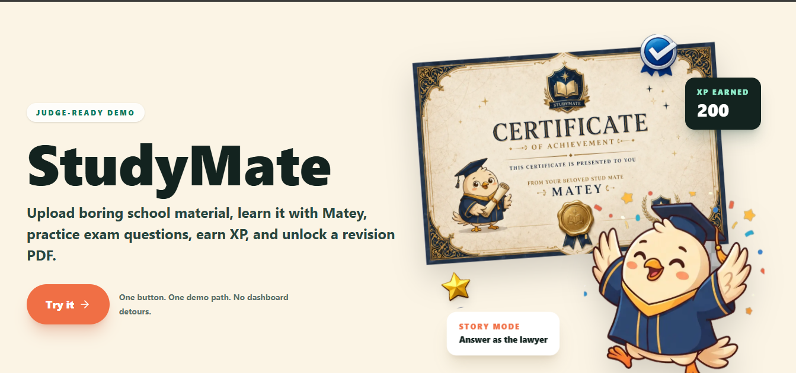
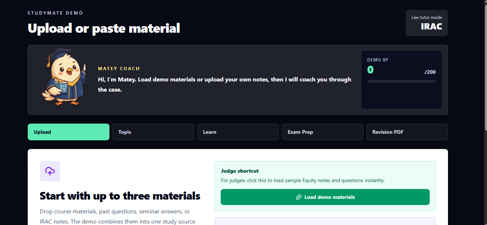
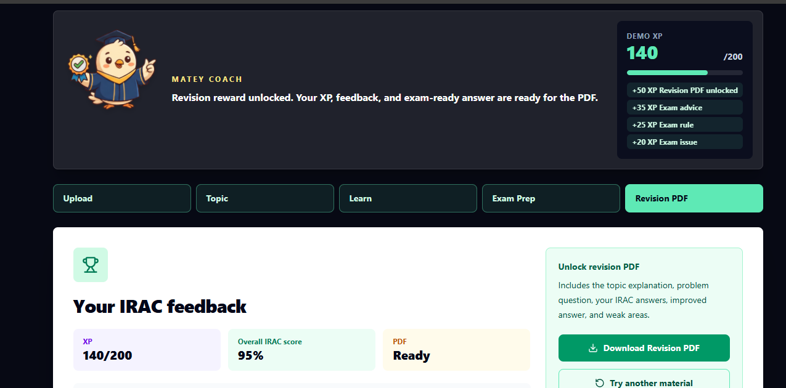
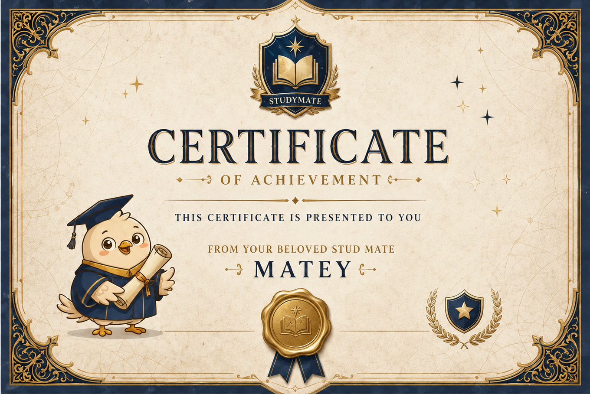

# StudyMate

<div align="center">



### Turn your notes into a complete study session: upload, learn, practice, earn, export.

[](https://nextjs.org)
[](https://typescriptlang.org)
[](https://azure.microsoft.com)
[](https://microsoft.com)

**Built for the Agents League Hackathon - Creative Apps track**

[Quick Start](#quick-start) | [Demo](#demo) | [Architecture](#architecture) | [Tech Stack](#tech-stack)

</div>

---

## At A Glance

| Item | Details |
|---|---|
| Track | Creative Apps |
| Main demo route | `/demo` |
| Microsoft IQ layer | Microsoft Foundry IQ |
| Copilot proof | GitHub Copilot workflow plus a local MCP server |
| Core hook | Learn course material through Plain Mode, Story Mode, Exam Prep, XP, and a revision PDF |
| Stack | Next.js, TypeScript, Tailwind CSS, Supabase, Azure OpenAI, Azure Document Intelligence, Foundry IQ, jsPDF |

## The Problem

Students revise from scattered PDFs, lecture notes, scanned pages, copied class materials, and past questions. Understanding the content is only half the battle. The harder part is turning that content into structured answers, exam practice, and revision notes that actually stick.

Most AI study tools stop at summaries. StudyMate goes further.

## The Solution

StudyMate turns a student's own materials into a guided study session:

```text
Upload material
  -> extract and organize source context
  -> learn in Plain Mode or Story Mode
  -> practice an exam question
  -> get feedback and weak areas
  -> earn XP
  -> download a revision PDF
```

## Meet Matey

<div align="center">


*Your personal study coach, always in your corner.*

</div>

Matey is the friendly guide who turns StudyMate from a blank chat box into a complete learning journey.

| Stage | What Matey Does |
|---|---|
| **Upload** | Helps students load notes, PDFs, images, pasted text, or demo material |
| **Plain Mode** | Explains difficult concepts clearly and directly |
| **Story Mode** | Turns a topic into a memorable scenario, such as advising a client in a law problem |
| **Exam Prep** | Coaches students through issue spotting, rules, application, and advice |
| **Revision PDF** | Celebrates the reward moment after XP and study feedback are unlocked |

## Visual Tour

<div align="center">

| Landing | Upload And Coach | Revision Reward |
|:---:|:---:|:---:|
|  |  |  |
| *Start the judge-ready demo* | *Load material and follow Matey* | *Earn XP and unlock the PDF* |

</div>

### Story Mode Preview

<div align="center">

| Client Scenario | Courtroom Scenario | Matey Thinking |
|:---:|:---:|:---:|
|  |  |  |

</div>

### Reward Moment

<div align="center">



*Earn XP, review weak areas, and download a revision PDF you can keep.*

</div>

---

## Demo

Judges can open `/demo` for the complete flow. No account is needed.

```text
http://localhost:3000/demo
```

The demo includes:

- Pre-loaded law/equity course material
- Matey coach prompts
- Plain Mode and Story Mode explanations
- IRAC Exam Prep practice question
- XP progress and weak-area feedback
- One-click revision PDF download

### Demo Walkthrough

<div align="center">

| Step 1 - Landing | Step 2 - Load Material | Step 3 - Story Context |
|:---:|:---:|:---:|
|  |  |  |

| Step 4 - Courtroom Practice | Step 5 - XP Feedback | Step 6 - PDF Reward |
|:---:|:---:|:---:|
|  |  |  |

</div>

## Why StudyMate Stands Out

| Other study apps | StudyMate |
|---|---|
| Generic summaries | Source-grounded explanations from the student's own material |
| One chat box | Guided loop: upload -> explain -> practice -> reward |
| Passive reading | Story Mode turns topics into memorable scenarios |
| No exam structure | IRAC-style coaching for stronger answers |
| No visible progress | XP, weak-area tracking, and revision PDF unlock |
| Scattered tools | One end-to-end flow built for fast judging |

## Architecture

```text
Next.js App Router
|
|-- Upload and intake
|   |-- PDF, TXT, MD, DOCX, JPG, PNG, pasted text, demo pack
|
|-- Course knowledge layer
|   |-- Azure Document Intelligence for OCR-ready extraction
|   |-- Structured wiki pages and source metadata
|   |-- Microsoft Foundry IQ retrieval adapter: lib/foundry-iq.ts
|
|-- Study agents
|   |-- Explainer agent: Plain Mode and Story Mode
|   |-- Quiz and exam-prep agents: IRAC coaching
|   |-- Key-points and flashcard agents
|   |-- Guardrail prompts for source-grounded answers
|
|-- Student outputs
    |-- Feedback and weak areas
    |-- XP progress
    |-- Revision PDF with jsPDF
```

<div align="center">


</div>

## Microsoft Foundry IQ Integration

The retrieval adapter lives in:

```text
lib/foundry-iq.ts
```

When the required credentials are configured, agent responses retrieve grounded course context from Foundry IQ. In local development, the adapter falls back to demo wiki context so the app can still be tested without exposing keys.

```env
FOUNDRY_IQ_ENDPOINT=
FOUNDRY_IQ_KEY=
FOUNDRY_IQ_KNOWLEDGE_BASE=
```

The UI and API metadata label every response with `foundry_iq` or `local_wiki_fallback`, and source names are displayed beside generated answers.

## GitHub Copilot Integration

GitHub Copilot was used throughout development to accelerate implementation, debug the upload flow, refactor the demo journey, add XP moments, and shape how Matey guides students.

A local MCP server lets Copilot in VS Code query StudyMate course context directly.

| File | Purpose |
|---|---|
| `COPILOT_CONTEXT(new).md` | Copilot project context documentation |
| `scripts/studymate-mcp-server.mjs` | Local MCP server |
| `.vscode/mcp.json` | VS Code MCP config |

The MCP tool exposed to Copilot is `search_course_context`, which returns cited excerpts from StudyMate course notes.

### MCP Quick Setup

```bash
npm run mcp:studymate
```

Point the server at exported course notes by setting:

```env
STUDYMATE_MCP_CONTEXT_FILE=path/to/your-context.json
```

Expected format:

```json
{
  "pages": [
    {
      "title": "Negligence",
      "content": "Course-grounded explanation...",
      "source_material": "Law of Torts Lecture Notes.pdf"
    }
  ]
}
```

## Tech Stack

| Layer | Technology |
|---|---|
| Framework | Next.js App Router, React, TypeScript |
| Styling | Tailwind CSS |
| Database | Supabase |
| AI and LLM | Azure OpenAI |
| OCR and extraction | Azure Document Intelligence |
| Retrieval | Microsoft Foundry IQ |
| PDF export | jsPDF |
| MCP | Model Context Protocol SDK |
| Testing | Vitest, Playwright |

## Quick Start

```bash
git clone https://github.com/adetorojeremiahfadesayo/Hackmic.git
cd Hackmic/studymate
npm install
cp .env.example .env.local
npm run dev
```

Open `http://localhost:3000` and navigate to `/demo` for the judge-ready flow.

### Environment Variables

```env
# Supabase
NEXT_PUBLIC_SUPABASE_URL=
NEXT_PUBLIC_SUPABASE_ANON_KEY=
SUPABASE_SERVICE_KEY=

# Azure OpenAI
AZURE_OPENAI_ENDPOINT=
AZURE_OPENAI_KEY=
AZURE_OPENAI_DEPLOYMENT=

# Microsoft Foundry IQ: optional locally, required for the IQ-backed demo
FOUNDRY_IQ_ENDPOINT=
FOUNDRY_IQ_KEY=
FOUNDRY_IQ_KNOWLEDGE_BASE=

# Azure Document Intelligence
AZURE_DOC_INTELLIGENCE_ENDPOINT=
AZURE_DOC_INTELLIGENCE_KEY=

# Demo mode
NEXT_PUBLIC_DEMO_MODE=true
```

## Quality Checks

```bash
npm test
npm run lint
npm run build
```

## Security

Never commit real keys, tokens, student data, or private course material.

All secrets belong in `.env.local`, which is already covered by `.gitignore`.

Before any public submission, verify no env file is tracked:

```bash
git ls-files -- ".env*" "**/.env*"
```

That command should return nothing.

## Submission Checklist

- [x] Creative Apps track: guided study experience with Story Mode, XP, and PDF reward
- [x] Microsoft IQ requirement: Foundry IQ adapter documented and included
- [x] GitHub Copilot requirement: usage documented, MCP server included
- [x] Demo route: `/demo` works without an account
- [x] Setup instructions: full local setup documented above
- [x] Security: `.env.local` is git-ignored

## Still Needed Before Submission

Add these when you have them:

- Live deployed app URL
- Demo video URL
- Agents League project/submission URL
- License file, if you want the README to show a license badge

---

<div align="center">


*Good luck. Now go ace that exam.*

</div>
